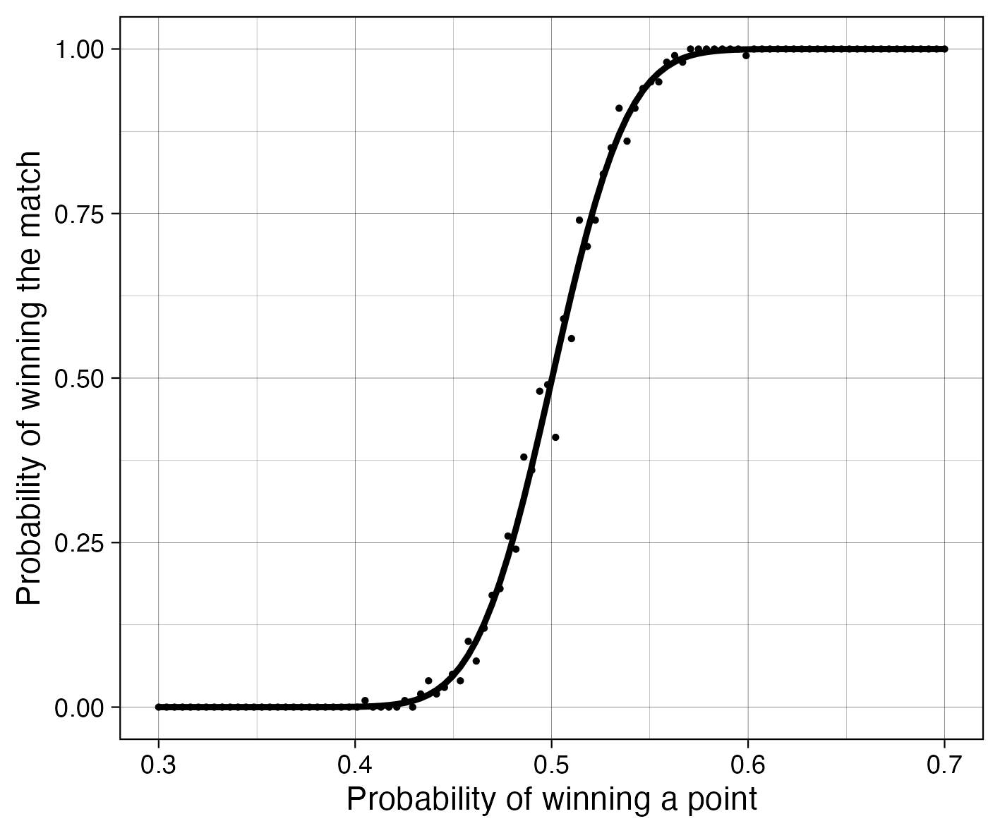

# Tennis Simulator
 Simulate a tennis match based on probability of winning each single point

Image you play a little better then your opponent, so that you have more than 50% chances of winning each point. What's the probability of winning the entire match?

You don't have to be much better than your opponent to win all of the matches:

